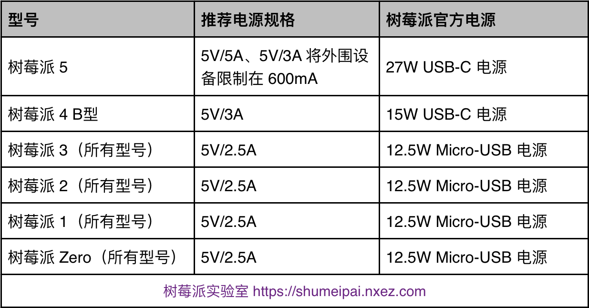
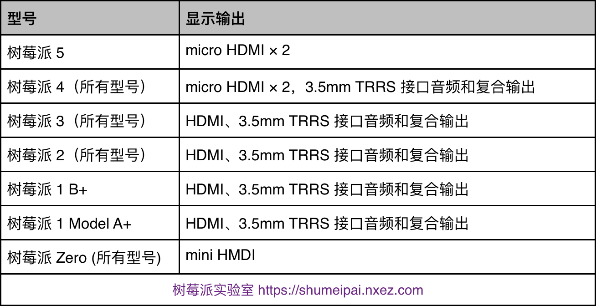
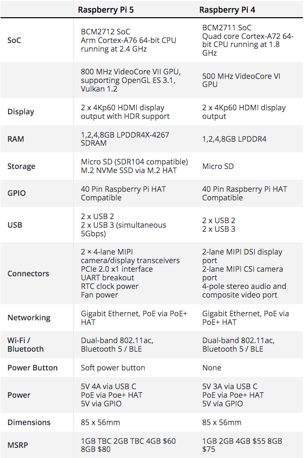
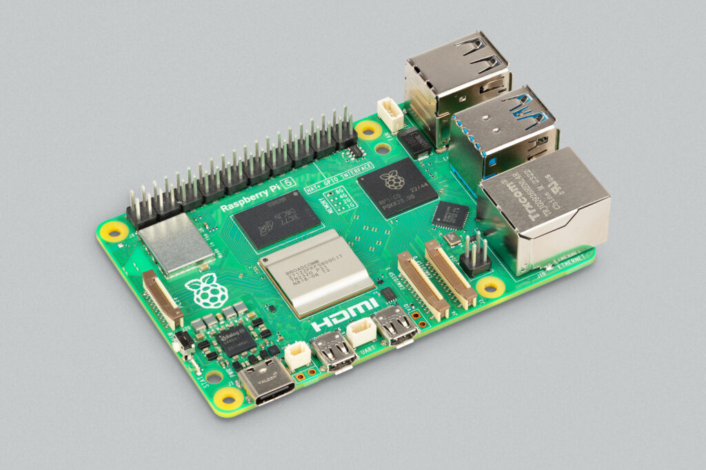

# [Raspberry-config](https://yaoqs.github.io/Raspberry-config/)

<a id="markdown-raspberry-config" name="raspberry-config"></a>

关于树莓派安装、配置、使用等的技巧、工具 \
About the skills and toolkits of installing, configuring raspbian and handbook for raspberry

<!-- TOC -->

- [Raspberry-config](#raspberry-config)
  - [开箱](#开箱)
  - [Install](#install)
  - [update](#update)
    - [固件更新](#固件更新)
      - [还原到稳定版本的方法](#还原到稳定版本的方法)
    - [EEPROM Boot Loader更新](#eeprom-boot-loader更新)
    - [内核编译](#内核编译)
  - [boot](#boot)
    - [参见boot目录下README.md](#参见boot目录下readmemd)
    - [u盘启动](#u盘启动)
  - [os/操作系统](#os操作系统)
    - [安装respbian.docx](#安装respbiandocx)
    - [kali in raspberry pi](#kali-in-raspberry-pi)
    - [Raspbian 操作系统](#raspbian-操作系统)
    - [raspberrypi/linux](#raspberrypilinux)
    - [Windows 10 IoT 系统](#windows-10-iot-系统)
  - [设置](#设置)
  - [树莓派 GPIO 控制](#树莓派-gpio-控制)
  - [Raspberry Pi Connect:树莓派远程桌面解决方案](#raspberry-pi-connect树莓派远程桌面解决方案)
  - [toolkit](#toolkit)
    - [\[树莓派通过网线直连笔记本电脑共享上网 .docx\](./树莓派通过网线直连笔记本电脑共享上网 .docx)](#树莓派通过网线直连笔记本电脑共享上网-docx树莓派通过网线直连笔记本电脑共享上网-docx)
  - [树莓派常用命令集合](#树莓派常用命令集合)
  - [Tutorial list](#tutorial-list)
  - [硬件](#硬件)
  - [集群/cluster](#集群cluster)
  - [软件](#软件)
    - [Python](#python)
  - [服务器管理](#服务器管理)
  - [有趣改造和扩展应用](#有趣改造和扩展应用)
  - [References](#references)
  - [Recommendation](#recommendation)
  - [News](#news)
    - [树莓派 5 评测：Maker 们的新宠](#树莓派-5-评测maker-们的新宠)
    - [树莓派 5 发布，新特性细节公布](#树莓派-5-发布新特性细节公布)
    - [树莓派 4 代](#树莓派-4-代)
    - [树莓派 4 代发布](#树莓派-4-代发布)
    - [树莓派 4 硬件配置](#树莓派-4-硬件配置)
    - [树莓派官方宣传片](#树莓派官方宣传片)
    - [树莓派有什么作用和用途？](#树莓派有什么作用和用途)
  - [License 许可证 \& Copyright](#license-许可证--copyright)

<!-- /TOC -->

## 开箱





## Install

<a id="markdown-install" name="install"></a>

现在树莓派提供全新的一键式安装方法：[imager](https://downloads.raspberrypi.org/imager/imager_latest.exe) 大大简化了开发人员的操作，提高了安装效率，降低了安装难度。[more...](https://www.raspberrypi.com/software/)

## update

<a id="markdown-update" name="update"></a>

```sh
getconf LONG_BIT        # 查看系统位数
uname -a            # kernel 版本
/opt/vc/bin/vcgencmd  version   # firmware版本
strings /boot/start.elf  |  grep VC_BUILD_ID    # firmware版本
cat /proc/version       # kernel
cat /etc/os-release     # OS版本资讯
cat /etc/issue          # Linux distro 版本
cat /etc/debian_version     # Debian版本编号
```

### 固件更新

<a id="markdown-%E5%9B%BA%E4%BB%B6%E6%9B%B4%E6%96%B0" name="%E5%9B%BA%E4%BB%B6%E6%9B%B4%E6%96%B0"></a>

rpi-update 是树莓派官方系统上的命令，用于将 Raspberry Pi OS 的内核和 VideoCore 固件更新到最新的预发布版本。

[注意](https://shumeipai.nxez.com/2023/07/16/the-rpi-update-command-for-raspberry-pi-os.html)：软件的预发布版本不保证能够工作。除非树莓派工程师建议，否则不要在任何系统上使用 rpi-update 命令。它可能会使你的系统不可靠，甚至完全崩溃。它不应作为任何常规更新过程的命令。

使用 rpi-update 将下载 linux 内核的最新预发布版本、其匹配模块、设备树文件以及最新版本的 VideoCore 固件。然后，它会将这些文件安装到 SD 卡上的相关位置，覆盖任何以前的版本。

rpi-update 使用的所有源数据都来自 rpi-firmware repository。该仓库仅包含来自官方固件存储库的数据子集，因为并不需要来自该存储库的所有数据。

```sh
sudo rpi-update
sudo reboot
```

#### 还原到稳定版本的方法

如果您已经执行完过 rpi-update 命令，但事情并不像你所希望的那样工作，如果你的树莓派仍然可以上电后正确进入引导程序，那么你可以使用以下命令返回到稳定版本：

```sh
sudo apt-get update
sudo apt install --reinstall libraspberrypi0 libraspberrypi-{bin,dev,doc} raspberrypi-bootloader raspberrypi-kernel
sudo reboot
```

### EEPROM Boot Loader更新

<a id="markdown-eeprom-boot-loader%E6%9B%B4%E6%96%B0" name="eeprom-boot-loader%E6%9B%B4%E6%96%B0"></a>

```sh
sudo apt-get install rpi-eeprom
sudo rpi-eeprom-update -a
```

### 内核编译

<a id="markdown-%E5%86%85%E6%A0%B8%E7%BC%96%E8%AF%91" name="%E5%86%85%E6%A0%B8%E7%BC%96%E8%AF%91"></a>

- 获取升级所需源码 官方网址：<https://github.com/raspberrypi> 上面列出了树莓派所有的开源软件
  - firmware：树莓派的交叉编译好的二进制内核、模块、库、bootloader
  - linux：内核源码
  - tools：编译内核和其他源码所需的工具——交叉编译器等
  - 我们只需要以上三个文件即可，下面的工程可以了解一下
    - documentation：树莓派离线帮助文档，教你如何使用、部署树莓派（树莓派官方使用教程）
    - userland：arm 端用户空间的一些应用库的源码——vc 视频硬浮点、EGL、mmal、openVG 等
    - hats：Hardware Attached on Top，树莓派 B+ 型板子的扩展板资料
    - maynard：一个 gtk 写成的桌面环境
    - scratch：一个简易、可视化编程环境
    - noobs：一个树莓派镜像管理工具，他可以让你在一个树莓派上部署多个镜像
    - weston：一个应用程序
    - target_fs：树莓派最小文件系统，使用 busybox 制作quake3：雷神之锤 3 有线开发源码 firmwareb
  - 下载

```sh
mkdir raspeberrypi_src
cd raspberrypi_src
git clone git://github.com/raspberrypi/firmware.git
git clone git://github.com/raspberrypi/linux.git
git clone git://github.com/raspberrypi/tools.git
```

- 编译、提取内核及其模块
  - 获得内核配置文件 在运行的树莓派中运行```$ls /proc/```
    - 可看到一个叫 config.gz 的文件，他是当前的树莓派配置选项记录文件，我们将他拷出，放入我们的内核源码目录树下。```$cp /proc/config /home/pi```
    - 我们这里使用前面交过的 samba 拷出并拷入内核源码目录下。在 linux 内核源码下执行：```$zcat config.gz > .config```
    - 把树莓派的配置文件写入.config。
  - 配置、编译内核
    - 修改内核源码 makefile ARCH 类型和编译器路径```$vi Makefile +195```
    - 查看、修改配置选项```$make menuconfig```
    - 编译内核镜像$make在arch/arm/boot目录下可以看到一个叫zImage的文件，就是我们新的内核，但是树莓派需要另外一种格式的镜像，需要进行处理一下，执行以下命令：```cd tools/mkimage``` ```./imagetool-uncompressed.py ../../linux/arch/arm/boot/zImage```
    - 即可在当前文件夹下看到一个叫kernel.img的文件，就是我们需要的新内核了。提取 modules 上一步其实不但编译出来了内核的源码，一些模块文件也编译出来了，这里我们提取一下，即可在 modules 得到我们需要的模块文件。

```sh
cd raspberrypi_src
mkdir modules
cd linux
make modules_install INSTALL_MOD_PATH=../modules
```

    - 升级 RPi 的 kernel、Firmware、lib
      - 升级内核，将新编好的内核拷入 SD 卡，改名为：kernel_new.img。打开 boot 目录下,找到config.txt文件，加入：kernel=kernel_new.img这一行。
      - 升级 boot，将firmware/boot/目录下文件拷入 SD 卡 boot 目录：fbootcode.bin fixup.dat fixup_cd.dat start.elf
      - 更新 vc 库及内核 modules，将编译出来的modules/lib/modules拷入树莓派文件系统/lib下

## boot

<a id="markdown-boot" name="boot"></a>

### 参见boot目录下[README.md](/boot/README.md)

<a id="markdown-%E5%8F%82%E8%A7%81boot%E7%9B%AE%E5%BD%95%E4%B8%8Breadme.md" name="%E5%8F%82%E8%A7%81boot%E7%9B%AE%E5%BD%95%E4%B8%8Breadme.md"></a>

### u盘启动

<a id="markdown-u%E7%9B%98%E5%90%AF%E5%8A%A8" name="u%E7%9B%98%E5%90%AF%E5%8A%A8"></a>

在树莓派3从u盘启动之前，需要从设置了使能usb boot mode的sd启动。该设置树莓派芯片上的OTP（一次性可编程内存），这将使得树莓派能够从usb设备启动。一旦设置了该选项，sd卡就不需要了。注意，OTP一旦做出任何改动，都不能复原。

你可以使用运行raspbian或者raspbian lite的sd卡来设置OTP,如果你还没有这样的sd卡，可按常规方式将系统烧入sd卡。
输入以下代码使能usb boot mode

```shell
echo program_usb_boot_mode=1 | sudo tee -a /boot/config.txt
```

这行代码将'program_usb_boot_mode=1'插入到/boot/cinfig.txt文件的末尾。使用sudo reboot命令重启树莓派后，用以下命令检查OTP设置：

```shell
$ vcgencmd otp_dump | grep 17:

17:3020000a
```

确保输出是’17:3020000a‘，如果输出不是这个，那就说明OTP没有设置成功。

之后，你可以在sd卡的config.txt末尾去掉program_usb_boot_mode=1这行代码，这样把这张sd用在其他树莓派上就不会设置OTP，注意，config.txt文件结尾不能有空行，你可以使用sudo nano /boot/config.txt命令使用nano 编辑器编辑config.txt文件。

## os/操作系统

<a id="markdown-os%2F%E6%93%8D%E4%BD%9C%E7%B3%BB%E7%BB%9F" name="os%2F%E6%93%8D%E4%BD%9C%E7%B3%BB%E7%BB%9F"></a>

树莓派官方的操作系统是Raspberry Pi OS:

树莓派系统下载地址(Raspberry OS download URL)[Download Page](https://www.raspberrypi.com/software/operating-systems/)

1. Raspberry Pi OS with desktop and recommended software

顾名思义，就是说带了图形化桌面系统和常用的推荐软件的版本，小白新手建议安装这个，免去后期单独安装软件的烦恼

2. Raspberry Pi OS with desktop

和第一个版本相比，带了图形化桌面系统，但没有常用的推荐软件，如果你的SD卡比较小，或者进阶者希望自己定义安装哪些软件则可以选择这个版本，后面自行定制安装所需要的软件

3. Raspberry Pi OS Lite

这个版本不带图形化桌面系统，则只有命令行界面(这才是真正的Linux OS的真面目:-)，如果你不需要图形化界面，或者你的设备是Raspberry Pi zero(w,h)等硬件配置比较低（CPU慢，内存小，SD卡特别小）的推荐安装这个版本。

### [安装respbian.docx](./安装respbian.docx)

<a id="markdown-%E5%AE%89%E8%A3%85respbian.docx" name="%E5%AE%89%E8%A3%85respbian.docx"></a>

### kali in raspberry pi

<a id="markdown-kali-in-raspberry-pi" name="kali-in-raspberry-pi"></a>

1. [How to Install Kali Linux on Raspberry Pi? (Complete Guide)](https://raspberrytips.com/use-kali-linux-raspberry-pi/)
2. [How to install Kali Linux on a USB for the RaspberryPi?](https://raspberrypi.stackexchange.com/questions/106762/how-to-install-kali-linux-on-a-usb-for-the-raspberrypi)

### Raspbian 操作系统

<a id="markdown-raspbian-%E6%93%8D%E4%BD%9C%E7%B3%BB%E7%BB%9F" name="raspbian-%E6%93%8D%E4%BD%9C%E7%B3%BB%E7%BB%9F"></a>

树莓派官方提供了 **Raspbian** 操作系统，一款基于 [Debian](https://www.iplaysoft.com/debian.html) 优化修改而来的 Linux 发行版，也是最常用的一个版本，专为树莓派而生，通用性强。


此外，你也能在官网下载到 [Ubuntu](https://www.iplaysoft.com/ubuntu.html) 类或其他诸如专为播放高清[电影](https://www.iplaysoft.com/tag/电影)而生的 OSMC、LibreELEC 等各种版本的系统，如下：

- Ubuntu MATE
- Ubuntu Core
- Ubuntu Server
- Windows 10 IoT Core
- OSMC
- LibreELEC
- PiNet
- RISC OS
- Weather Station
- IchigoJam RPi

你几乎完全可以将树莓派 4 当做一台完整的台式电脑来使用，而得益于性能的大幅提升，本次升级后，树莓派的应用范围将会又得到了扩展。

### raspberrypi/linux

<a id="markdown-raspberrypi%2Flinux" name="raspberrypi%2Flinux"></a>

[raspberrypi/linux](https://github.com/raspberrypi/linux) Kernel source tree for Raspberry Pi-provided kernel builds. Issues unrelated to the linux kernel should be posted on the community forum at <https://forums.raspberrypi.com/>

### Windows 10 IoT 系统

<a id="markdown-windows-10-iot-%E7%B3%BB%E7%BB%9F" name="windows-10-iot-%E7%B3%BB%E7%BB%9F"></a>

除了 Linux 之外，[微软](https://www.iplaysoft.com/tag/%E5%BE%AE%E8%BD%AF)也已经跟树莓派基金会达成合作以确保 [Windows 10](https://www.iplaysoft.com/windows10.html) 可以适配树莓派新款产品，如今完美适配树莓派 2 / 3 代的 **Windows 10 IoT core 物联网核心版**系统已经「免费」提供给用户下载。截稿为止，4 代似乎还未适配。


[下载 Win10 IoT 物联网系统 for 树莓派](https://www.iplaysoft.com/windows10-iot.html)

## 设置

<a id="markdown-%E8%AE%BE%E7%BD%AE" name="%E8%AE%BE%E7%BD%AE"></a>

- Advanced Options 高级设置 （$ sudo raspi-config）
  - A1 Overscan 是否让屏幕内容全屏显示
  - A2 Hostname 在网上邻居或者路由器能看到的主机名称
  - A3 Memory Split 内存分配，选择给 GPU 多少内存
  - A4 SSH 是否运行 SSH 登录，建议开启此选项，以后操作 PI 方便，有网络就行，不用开屏幕了
  - A5 SPI 是否默认启动 SPI 内核驱动，新手就不用管了
  - A6 Audio 选择声音默认输出到模拟口还是 HDMI 口A7 Update 把 raspi-config 这个工具自动升级到最新版本
- 树莓派网络与更新配置
- 使用远程桌面
  - 通过 Windows 自带的远程桌面软件，可以远程访问树莓派桌面应用 ```sudo apt-get install xrdp```
- 使用 samba
  - 通过 samba 服务，可以自由、访问修改树莓派家目录下的文件、代码。
  - 首先安装 ```sambasudo apt-get install samba samba-common-bin```
  - 然后修改配置文件```sudo vi /etc/samba/smb.conf```
  - 重启 samba 服务```sudo /etc/init.d/samba restart```
  - 把系统默认用户 pi 添加到 ```sambasudo smbpasswd -a pi```
- 挂载 U 盘
  - 当需要大容量外接存储设备时，可使用 U 盘挂载。通常我们在 /mnt 或 /media 目录下新建一个目录作为挂载点。比如：```sudo mkdir /mnt/udisk```
  - 手动挂挂载：挂载命令：```sudo mount -o uid=pi,gid=pi /dev/sda1 /mnt/udisk```
  - 用完之后卸载 ```sudo umount /mnt/1GB_USB_flash```
  - 安装 exfat-fuse 软件之后 mount 就支持了。```sudo apt-get install exfat-fuse```
  - 开机挂载 如果想开机自动挂载，而不是每次手工执行，可以编辑 /etc/fstab 文件。在末尾添加一行：```/dev/sda1 /mnt/udisk vfat rw,defaults 0 0``` 每次开机就会自动挂载。
  - 热插挂载 需要希望想电脑一样，插上自动识别挂载在某一目录下，拔下自动 umount，请按一下操作 ```sudo vi /etc/udev/rules.d/10-usbstorage.rules```(此文件默认没有，需要新建).赋值以下内容即可，会自动在 /mnt/udisk 目录下挂载 U 盘。

```auto
KERNEL!="sd*", GOTO="media_by_label_auto_mount_end"
SUBSYSTEM!="block",GOTO="media_by_label_auto_mount_end"
IMPORT{program}="/sbin/blkid -o udev -p %N"
ENV{ID_FS_TYPE}=="", GOTO="media_by_label_auto_mount_end"
ENV{ID_FS_LABEL}!="", ENV{dir_name}="%E{ID_FS_LABEL}"
ENV{ID_FS_LABEL}=="", ENV{dir_name}="Untitled-%k"
ACTION=="add", ENV{mount_options}="relatime,sync"
ACTION=="add", ENV{ID_FS_TYPE}=="vfat", ENV{mount_options}="iocharset=utf8,umaskk=000"
ACTION=="add", ENV{ID_FS_TYPE}=="ntfs", ENV{mount_options}="iocharset=utf8,umaskk=000"
ACTION=="add", RUN+="/bin/mkdir -p /mnt/udisk/", RUN+="/bin/mount -o $env{mount__options} /dev/%k /mnt/udisk/"

ACTION=="remove", ENV{dir_name}!="", RUN+="/bin/umount -l /mnt/udisk/", RUN+="/bin/rmdir /mnt/udisk/"
LABEL="media_by_label_auto_mount_end"
```

- 树莓派做 web 服务器
  - 树莓派可以安装这个 LAMP 系列，但 Apache 和 MySql 对于树莓派这个小机器稍微有些太重了，主要是消耗内存多/速度慢/占用磁盘大 (约 200M)，所可以选择安装一个轻量级的 Web 服务器：nginx + php + sqlite
  - 安装 nginx web 服务器 (约 6MB)```sudo apt-get install nginx```
  - 启动 nginx ```sudo /etc/init.d/nginx start```nginx 的 www 根目录默认在/usr/share/nginx/www中
  - 修改 nginx 的配置文件 ```sudo vi /etc/nginx/sites-available/default```
  - PHP 脚本支持 找到 php 的定义段，将这些行的注释去掉 ，修改后内容如下

```auto
location ~ .php$ {
　fastcgi_pass unix:/var/run/php5-fpm.sock;
　fastcgi_index index.php;
　include fastcgi_params;
}
```

- 安装 php 和 sqlite (约 3MB) ```sudo apt-get install php5-fpm php5-sqlite```
- 重新加载 nginx 的配置 ```sudo /etc/init.d/nginx reload```

## 树莓派 GPIO 控制

<a id="markdown-%E6%A0%91%E8%8E%93%E6%B4%BE-gpio-%E6%8E%A7%E5%88%B6" name="%E6%A0%91%E8%8E%93%E6%B4%BE-gpio-%E6%8E%A7%E5%88%B6"></a>

树莓派内核中已经编译自带了 gpio 的驱动，我们常通过一些第三方写好的库函数来完成具体的操作，比较常见的操作库函数有：

- python GPIO
  - 开发语言：python，树莓派的“Pi”就是由于最早的开发者希望在上面用Python 而起名的。
  - 简单介绍：树莓派官方资料中推荐且容易上手，python GPIO 是一个小型的 python 库，可以帮助用户完成 raspberry 相关 IO 口操作，但是 python GPIO 库还没有支持 SPI、I2C 或者 1-wire 等总线接口。
  - 官方网站： <https://code.google.com/p/raspberry-gpio-python/>
- wiringPi
  - 开发语言：C 语言
  - 简单介绍：wiringPi 适合那些具有 C 语言基础，在接触树莓派之前已经接触过单片机或者嵌入式开发的人群。wiringPi 的 API 函数和 arduino 非常相似，这也使得它广受欢迎。作者给出了大量的说明和示例代码，这些示例代码也包括 UART 设备，I2C 设备和 SPI 设备等。
  - 官方网站： <http://wiringpi.com/>
- BCM2835 C Library
  - 开发语言：C 语言
  - 简单介绍：BCM2835 C Library 可以理解为使用 C 语言实现的相关底层驱动，BCM2835 C Library 的驱动库包括 GPIO、SPI 和 UART 等，可以通过学习 BCM2835 C Library 熟悉 BCM2835 相关的寄存器操作。如果有机会开发树莓派上的 linux 驱动，或自主开发 python 或 PHP 扩展驱动，可以从 BCM2835 C Library 找到不少的 “灵感”。
  - 官方网站： <http://www.airspayce.com/mikem/bcm2835/>

## Raspberry Pi Connect:树莓派远程桌面解决方案

树莓派官方近期发布了 Raspberry Pi Connect [测试版](https://www.raspberrypi.com/software/connect/)：这是一种安全、易用的方法，只需使用网络浏览器，就能从地球上的任何地方远程访问你的树莓派。

## toolkit

<a id="markdown-toolkit" name="toolkit"></a>

- ~~参见toolkit目录下[README.md](/toolkit/README.md)~~
- menu
  - 刷机
    - ~~可从网上查找安全下载地址，或使用本人提供的，亲测安全有效~~
    - ~~[SD Card Formatter.rar](https://github.com/yaoqs/Raspberry-config/blob/master/toolkit/%E5%88%B7%E6%9C%BA/SD%20Card%20Formatter.rar) [SDCardFormatterv5_WinEN.zip](https://github.com/yaoqs/Raspberry-config/blob/master/toolkit/%E5%88%B7%E6%9C%BA/SDCardFormatterv5_WinEN.zip)~~
    - ~~[usbit.zip](https://github.com/yaoqs/Raspberry-config/blob/master/toolkit/%E5%88%B7%E6%9C%BA/usbit.zip)~~
    - ~~[win32diskimager.zip](https://github.com/yaoqs/Raspberry-config/blob/master/toolkit/%E5%88%B7%E6%9C%BA/win32diskimager-v0.9-binary.zip)~~
    - ~~balenaEtcher~~
    - [Raspberry Pi Imager](https://www.raspberrypi.com/software/) is the quick and easy way to install Raspberry Pi OS and other operating systems to a microSD card, ready to use with your Raspberry Pi.
  - 调试终端
    - 建议使用系统自带ssh
    - ~~[FCN.zip 官网](https://github.com/boywhp/fcn)~~
    - ~~[WinSCP.exe 官网](https://winscp.net/eng/index.php) 是一个 Windows 环境下使用的 SSH 的开源图形化 SFTP 客户端。同时支持 SCP 协议。它的主要功能是在本地与远程计算机间安全地复制文件，并且可以直接编辑文件。WinSCP is an open source free SFTP client, FTP client, WebDAV client, S3 client and SCP client for Windows. Its main function is file transfer between a local and a remote computer. Beyond this, WinSCP offers scripting and basic file manager functionality.~~
    - [putty.exe 官网](https://www.chiark.greenend.org.uk/~sgtatham/putty/) 知名ssh软件
    - [sscom5.13.1.exe 官网](http://www.daxia.com/) 新版安全可靠强大，包含串口调试、tcp及udp通讯调试
  - PortScan.exe 用于在局域网内查找树莓派的IP
  - **nmap 功能强大的ip、端口扫描工具**

### [树莓派通过网线直连笔记本电脑共享上网 .docx](./树莓派通过网线直连笔记本电脑共享上网 .docx)

<a id="markdown-%E6%A0%91%E8%8E%93%E6%B4%BE%E9%80%9A%E8%BF%87%E7%BD%91%E7%BA%BF%E7%9B%B4%E8%BF%9E%E7%AC%94%E8%AE%B0%E6%9C%AC%E7%94%B5%E8%84%91%E5%85%B1%E4%BA%AB%E4%B8%8A%E7%BD%91-.docx" name="%E6%A0%91%E8%8E%93%E6%B4%BE%E9%80%9A%E8%BF%87%E7%BD%91%E7%BA%BF%E7%9B%B4%E8%BF%9E%E7%AC%94%E8%AE%B0%E6%9C%AC%E7%94%B5%E8%84%91%E5%85%B1%E4%BA%AB%E4%B8%8A%E7%BD%91-.docx"></a>

## 树莓派常用命令集合

<a id="markdown-%E6%A0%91%E8%8E%93%E6%B4%BE%E5%B8%B8%E7%94%A8%E5%91%BD%E4%BB%A4%E9%9B%86%E5%90%88" name="%E6%A0%91%E8%8E%93%E6%B4%BE%E5%B8%B8%E7%94%A8%E5%91%BD%E4%BB%A4%E9%9B%86%E5%90%88"></a>

```bash
 sudo apt-get update
 sudo apt-get upgrade
 sudo apt-get install vim
 cd /etc/apt/
 sudo vim /etc/apt/sources.list
 ping ustc.edu.cn
 sudo passwd
 reboot
 sudo reboot
 su root
 sudo passwd pi
 sudo apt-get install python-pip
 sudo apt-get install fuse-utils ntfs-3g
 modprobe fuse
 sudo modprobe fuse
 sudo vim /etc/fstab
 sudo apt-get install exfat-fuse
 sudo pip install bpython
 sudo apt-get install python-dev
 sudo pip install ipython
 sudo apt-get install nmap
 sudo pip install ipython
 sudo pip install bpython
 sudo pip install virtualenv
 df
 df -lh
 fdisk -l
 sudo fdisk -l
 df -h
 sudo fdisk /dev/mmcblk0
 sudo reboot
 sudo resize2fs /dev/mmcblk0p2
 sudo apt-get install -y dnsmasq
 sudo vim /etc/dnsmasq.conf
 sudo service dnsmasq restart
 dig
 sudo apt-get install dnsutils
 ls
 dig www.baidu.com
 sudo vim /etc/dnsmasq.conf
 sudo service dnsmasq restart
 dig www.baidu.com
 sudo vim /etc/resolv.conf
 sudo service dnsmasq restart
 dig www.baidu.com
 chkconfig dnsmapq on
 find resolv.dnsmapq.conf
 sudo vim /etc/dnsmasq.conf
 netstat -lpnt
 ps -ef
 ifconfig
 sudo service --status-all
 service dnsmasq status
 sudo apt-get install git
 sudo easy_install -U distribute
 sudo pip install rpi.gpio
 alias ll='ls -lh'
 source /etc/profile
 sudo raspi-config
```

```sh
#安装软件 
apt-get install softname1 softname2 softname3……
#卸载软件 
apt-get remove softname1 softname2 softname3……
#卸载并清除配置 
apt-get remove –purge softname1
#更新软件信息数据库 
apt-get update
#进行系统升级 
apt-get upgrade
#搜索软件包 
apt-cache search softname1 softname2 softname3……
#安装deb软件包 
dpkg -i xxx.deb
#删除软件包 
dpkg -r xxx.deb
#连同配置文件一起删除 
dpkg -r –purge xxx.deb
#查看软件包信息 
dpkg -info xxx.deb
#查看文件拷贝详情 
dpkg -L xxx.deb
#查看系统中已安装软件包信息
dpkg -l
#重新配置软件包 
dpkg-reconfigure xxx

#清除所有已删除包的残馀配置文件
dpkg -l |grep ^rc|awk '{print $2}' |sudo xargs dpkg -P
#如果报如下错误，证明你的系统中没有残留配置文件了，无须担心。
dpkg: –purge needs at least one package name argument
#dpkg安裝的可以用apt卸載，反之亦可

#aptitude 与 apt-get 一样，是 Debian 及其衍生系统中功能极其强大的包管理工具。与 apt-get 不同的是，aptitude 在处理依赖问题上更佳一些。举例来说，aptitude 在删除一个包时，会同时删除本身所依赖的包。这样，系统中不会残留无用的包，整个系统更为干净。以下是笔者总结的一些常用 aptitude 命令，仅供参考。

aptitude update 更新可用的包列表
aptitude upgrade 升级可用的包
aptitude dist-upgrade 将系统升级到新的发行版
aptitude install pkgname 安装包
aptitude remove pkgname 删除包
aptitude purge pkgname 删除包及其配置文件
aptitude search string 搜索包
aptitude show pkgname 显示包的详细信息
aptitude clean 删除下载的包文件
aptitude autoclean 仅删除过期的包文件

apt-cache search # ------(package 搜索包)
apt-cache show #------(package 获取包的相关信息，如说明、大小、版本等)
sudo apt-get install # ------(package 安装包)
sudo apt-get install # -----(package - - reinstall 重新安装包)
sudo apt-get -f install # -----(强制安装?#"-f = --fix-missing"当是修复安装吧...)
sudo apt-get remove #-----(package 删除包)
sudo apt-get remove - - purge # ------(package 删除包，包括删除配置文件等)
sudo apt-get autoremove --purge # ----(package 删除包及其依赖的软件包+配置文件等（只对6.10有效，强烈推荐）)
sudo apt-get update #------更新源
sudo apt-get upgrade #------更新已安装的包
sudo apt-get dist-upgrade # ---------升级系统
sudo apt-get dselect-upgrade #------使用 dselect 升级
apt-cache depends #-------(package 了解使用依赖)
apt-cache rdepends # ------(package 了解某个具体的依赖?#当是查看该包被哪些包依赖吧...)
sudo apt-get build-dep # ------(package 安装相关的编译环境)
apt-get source #------(package 下载该包的源代码)
sudo apt-get clean && sudo apt-get autoclean # --------清理下载文件的存档 && 只清理过时的包
sudo apt-get check #-------检查是否有损坏的依赖
```

## [Tutorial list](https://github.com/yaoqs/Raspberry-config/tree/master/Tutorial%20list)

<a id="markdown-tutorial-list" name="tutorial-list"></a>

个人收藏的raspberry pi/树莓派文章及教程

## 硬件

<a id="markdown-%E7%A1%AC%E4%BB%B6" name="%E7%A1%AC%E4%BB%B6"></a>

- [Raspberry Pi PCIe Devices](https://pipci.jeffgeerling.com/)
- [raspberry-pi-pcie-devices](https://github.com/geerlingguy/raspberry-pi-pcie-devices) Raspberry Pi PCI Express device compatibility database
- [pico-usbtest](https://github.com/notro/pico-usbtest) usbtest for Raspberry Pi Pico
- [pico-usb-io-board](https://github.com/notro/pico-usb-io-board) Raspberry Pi Pico USB I/O Board
- [树莓派OLED模块的使用教程大量例程详解](https://www.cnblogs.com/ChuanYangRiver/p/15305203.html)
- [树莓派 使用C对GPIO编程](https://www.cnblogs.com/lxz365/articles/12831076.html)

## 集群/cluster

<a id="markdown-%E9%9B%86%E7%BE%A4%2Fcluster" name="%E9%9B%86%E7%BE%A4%2Fcluster"></a>

- Linux 集群之美
- [多角度展现 Linux 集群之美](https://blog.csdn.net/hzbooks/article/details/121882513)
- [k3s-ansible](https://github.com/k3s-io/k3s-ansible) Build a Kubernetes cluster using k3s via Ansible,Author: <https://github.com/itwars>
- [pi-cluster](https://github.com/geerlingguy/pi-cluster) Raspberry Pi Cluster automation
- [raspberry-pi-dramble](https://github.com/geerlingguy/raspberry-pi-dramble)  DEPRECATED - Raspberry Pi Kubernetes cluster that runs HA/HP Drupal 8;A cluster (Bramble) of Raspberry Pis on which Drupal is deployed using Ansible and Kubernetes. [pi-cluster](https://github.com/geerlingguy/pi-cluster) project for active development

- [clusterhat-image](https://github.com/burtyb/clusterhat-image) Converts Raspbian/Raspberry Pi OS images to support Cluster HAT

- [花式玩转Linux集群免密登录](https://juejin.cn/post/7086088679189381134)
- [linux集群服务器搭建](https://blog.csdn.net/manongxianfeng/article/details/113935886)
- [如何搭建一个小型高性能计算集群？](https://www.zhihu.com/question/281519069)

- [mqtt-cluster](https://gitee.com/quickmsg/mqtt-cluster) 一款高性、高吞吐量、高扩展性的物联网mqtt集群broker！支持千万级+链接，同时支持自定义扩展功能，功能非常强大！
- [SMQTT](https://www.smqtt.cc/) 一款高性能&开源的MQTT服务器，支持单机、容器化、集群部署，支持多种协议，具备低延迟，高吞吐量，支持百万TCP连接。MQTT协议提供了一种使用发布/订阅模型执行消息传递的轻量级方法。这使得它适用于物联网消息传递，如低功耗传感器或手机、嵌入式计算机或微控制器等移动设备。SMQTTX是一个开源mqtt消息代理服务器，它实现了MQTT协议版本3.1.1和3.1。SMQTTX是轻量级，适用于从低功耗单板计算机到全服务器的所有设备。SMQTTX非常友好地支持快速配置，对于java应用可以非常容易完成二次开发，并且拥有高性能高吞吐量的mqtt服务

## 软件

<a id="markdown-%E8%BD%AF%E4%BB%B6" name="%E8%BD%AF%E4%BB%B6"></a>

- [internet-pi](https://github.com/geerlingguy/internet-pi) A Raspberry Pi Configuration for Internet connectivity

### Python

<a id="markdown-python" name="python"></a>

- [RPi.GPIO 0.6.5](https://pypi.org/project/RPi.GPIO/)
 >
 > ```python
 > pip install RPi.GPIO
 > ```

## 服务器管理

<a id="markdown-%E6%9C%8D%E5%8A%A1%E5%99%A8%E7%AE%A1%E7%90%86" name="%E6%9C%8D%E5%8A%A1%E5%99%A8%E7%AE%A1%E7%90%86"></a>

- [iis7服务器管理工具](http://fwqglgj.iis7.net/) mstsc远程桌面、linux、ssh、sftp、vnc、ftp、webshell（批量管理），链接类客户端软件下载。
- wol/wakeonlan
  - [go-wol](https://github.com/sabhiram/go-wol) describes a simple data link layer protocol which tells a listening ethernet interface to power the target machine up.
  - [WakeOnLAN](https://github.com/GramThanos/WakeOnLAN) A simple C program that sends a magic packet
  - [wakemeonlan](https://www.nirsoft.net/utils/wake_on_lan.html)

## 有趣改造和扩展应用

- [有哪些对树莓派的有趣改造和扩展应用](https://www.zhihu.com/question/20697024)
- **[NAS](https://yaoqs.github.io/NAS)**
- 智能设备

## References

<a id="markdown-references" name="references"></a>

- [树莓派实验室 | Raspberry Pi中文资讯站，提供丰富的树莓派使用教程和DIY资讯](http://shumeipai.nxez.com)
- [NanoPi Embedded system for ARM SBC,Computer-on-Module and Custom Design]( http://www.nanopi.org/)
- [有哪些对树莓派的有趣改造和扩展应用？](https://www.zhihu.com/question/20697024)
- [raspbian release_notes.txt](http://downloads.raspberrypi.org/raspbian/release_notes.txt)
- [中国石油大学 (华东) Linux 协会 树莓派](https://upclinux.github.io/intro/09/raspberry-pi/)
- [Raspberry Pi用户指南 王伟 许金超 郭栋 梁黎颖 译 出版社：人民邮电出版社 出版日期：2013年8月   ISBN：9787115323675](http://book.51cto.com/art/201312/420490.htm)
- [树莓派 嵌入式以太网社区](http://www.embed-net.com/forum-64-1.html)
- [自己制作树莓派3B+ 64位系统（编译内核+rootfs制作）](https://blog.csdn.net/m0_49475727/article/details/109247979)

## Recommendation

<a id="markdown-recommendation" name="recommendation"></a>

- [Raspberry Pi Documentation](https://www.raspberrypi.com/documentation/) official document
- [blackout314/awesome-raspberry-pi](https://github.com/blackout314/awesome-raspberry-pi)

## News

<a id="markdown-news" name="news"></a>

### [树莓派 5 评测：Maker 们的新宠](https://shumeipai.nxez.com/2023/09/29/raspberry-pi-5-review-a-new-standard-for-makers.html)

据树莓派官方声称。Raspberry Pi 5 的处理能力是 Raspberry Pi 4 的两到三倍，后者已经是一款功能强大的单板计算机。Raspberry Pi 5 提供 4GB 和 8GB RAM 容量（稍后还会推出 1GB 和 2GB 型号），其基本尺寸和形状与 Model 4 B 相同，但增加了许多人们长期要求的功能，例如内置实时时钟、一个 PCIe 2.0 连接器和一个电源按钮。

也许更重要的是，Raspberry Pi 配备了新的四核 2.4 GHz Cortex-A76 Arm CPU（旧型号最初是运行在 1.5 GHz 的 Cortex-A72，但固件更新使其达到 1.8 GHz）、新的南桥承诺提高 USB 3 吞吐量和运行频率为 800 Mhz 的新 VideoCore VII GPU（相对于 Pi 4 上的 500 MHz VideoCore VI）。整个主板有很多小改进，包括带安装孔的内置风扇接头、更快的双摄像头连接器以及可与高速卡配合使用的 microSD 读卡器。



### [树莓派 5 发布，新特性细节公布](https://shumeipai.nxez.com/2023/09/28/introducing-raspberry-pi-5.html)



主要功能包括：

- 2.4GHz 四核 64 位 Arm Cortex-A76 CPU
- VideoCore VII GPU，支持 OpenGL ES 3.1、Vulkan 1.2
- 双 4Kp60 HDMI 显示输出
- 4Kp60 HEVC 解码器
- 双频 802.11ac 无线网络
- 蓝牙 5.0 / 低功耗蓝牙（BLE）
- 高速 microSD 卡接口，支持 SDR104 模式
- 2 个 × USB 3.0 端口，支持同时 5Gbps 操作
- 2 个 × USB 2.0 端口
- 千兆以太网，支持 PoE+（需要单独的 PoE+ HAT，即将推出）
- 2 × 4 通道 MIPI 摄像头/显示器接口
- 用于快速外设的 PCIe 2.0 x1 接口
- 树莓派标准 40 针 GPIO 接口
- 板载实时时钟 RTC
- 电源按键

新平台，新芯片组:三个新芯片，每个芯片都是专门为树莓派5 设计的，它们结合在一起，在性能上实现了飞跃。

- BCM2712是 Broadcom 的新型 16 纳米应用处理器（AP），源自为树莓派4提供支持的 28 纳米 BCM2711 AP，具有许多架构增强功能。其核心是一个四核 64 位 Arm Cortex-A76 处理器，时钟频率为 2.4GHz，每核 L2 缓存为 512KB，共享 L3 缓存为 2MB。Cortex-A76 是 Cortex-A72 的三代微架构，每个时钟（IPC）提供更多指令，每条指令的能耗更低。更新的内核、更高的时钟速度和更小的流程几何形状的组合产生了更快的树莓派，并且对于给定的工作负载消耗的功率要少得多。
- RP1是用于树莓派5 的 I/O 控制器，由交付 RP2040 微控制器的树莓派团队设计，并与 RP2040 一样，在台积电成熟的 40LP 工艺上实现。它提供两个 USB 3.0 和两个 USB 2.0 接口、千兆以太网控制器、两个用于摄像头和显示器的四通道 MIPI 收发器、模拟视频输出、3.3V 通用 I/O（GPIO）、以及通常的 GPIO 多路复用低速接口（UART、SPI、I2C、I2S 和 PWM）集合。四通道 PCI Express 2.0 接口提供返回 BCM2712 的 16Gb/s 链路。
- DA9091:BCM2712 和 RP1 由芯片组的第三个新组件瑞萨 DA9091“Gilmour” 电源管理 IC（PMIC）提供支持。它集成了八个独立的开关模式电源，以产生电路板所需的各种电压，包括一个四相内核电源，能够提供 20 安培的电流，为 Cortex-A76 内核和其他 BCM2712 数字逻辑供电。通过与爱丁堡的瑞萨电子团队的密切合作，生产出一款精确调整的 PMIC。挤进两个经常要求的功能：实时时钟（RTC），可以由外部超级电容器或可充电锂锰电池供电、以及 PC 式电源按钮，支持硬断电和软断电和开机事件。芯片组的另外两个元素保留了树莓派4。英飞凌 CYW43455 组合芯片提供双频 802.11ac Wi-Fi 和低功耗蓝牙（BLE）蓝牙 5.0，虽然芯片本身保持不变，但它配备了专用的开关电源轨以降低功耗，并通过升级的 SDIO 接口连接到BCM2712，该接口支持 DDR50 模式以获得更高的潜在吞吐量。和以前一样，以太网连接由博通 BCM54213 千兆以太网 PHY 提供。

### [树莓派 4 代](https://www.iplaysoft.com/raspberrypi.html)

全球最流行的 Linux 小型迷你电脑，性能大幅飙升！(支持4K / USB3.0)


被誉为 “世界上最流行最便宜的小型电脑” 的「[树莓派](https://www.iplaysoft.com/go/raspberrypi)」**Raspberry Pi** 是一款性价比超高的迷你电脑主机 (仅有信用卡大小)，深受全球开发者、极客、技术爱好者们的追捧和喜爱。

树莓派可以安装多种 [Linux](https://www.iplaysoft.com/os/linux-platform) 系统发行版 (官方为 [Debian](https://www.iplaysoft.com/debian.html) 的衍生版)，可当[服务器](https://www.iplaysoft.com/tag/%E6%9C%8D%E5%8A%A1%E5%99%A8)搭建各种网站、应用服务来使用，也能用来学习[编程](https://www.iplaysoft.com/tag/编程)、控制硬件或日常[办公](https://www.iplaysoft.com/tag/办公)。由于树莓派的体积很小很轻，并且功能极其丰富强大，这也使得它的应用范围和潜力几乎是无限的……

### 树莓派 4 代发布

<a id="markdown-%E6%A0%91%E8%8E%93%E6%B4%BE-4-%E4%BB%A3%E5%8F%91%E5%B8%83" name="%E6%A0%91%E8%8E%93%E6%B4%BE-4-%E4%BB%A3%E5%8F%91%E5%B8%83"></a>

如今 **Raspberry Pi 4** 「[树莓派 4 代](https://www.iplaysoft.com/go/raspberrypi)」终于正式发布了！！官方定价依然是 $35 美元起不变，但整体性能相比 3 代要提升了三倍之多！多媒体性能为四倍，即使同时外接两台 [4K](https://www.iplaysoft.com/tag/4k) 显示器双屏工作也毫无鸭梨。这么小的体积加上如此强劲的性能，这将是一款再次改变行业规则的产品。

[](https://www.iplaysoft.com/go/raspberrypi)

而且除了 [Linux](https://www.iplaysoft.com/os/linux-platform) 外，树莓派还能运行「[免费的 Win 10 物联网版系统](https://www.iplaysoft.com/windows10-iot.html)」！无论是[学习](https://www.iplaysoft.com/tag/%E5%AD%A6%E4%B9%A0)、办公、[编程](https://www.iplaysoft.com/tag/编程)、搭建智能家居、工控设备、还是用于特定的工作场景，树莓派都是最理想的小型电脑。也是每一个喜欢折腾电脑、折腾数码、折腾程序的朋友的必备玩物。

### 树莓派 4 硬件配置

<a id="markdown-%E6%A0%91%E8%8E%93%E6%B4%BE-4-%E7%A1%AC%E4%BB%B6%E9%85%8D%E7%BD%AE" name="%E6%A0%91%E8%8E%93%E6%B4%BE-4-%E7%A1%AC%E4%BB%B6%E9%85%8D%E7%BD%AE"></a>

**树莓派四代** (Raspberry Pi 4 Model B) 在硬件方面迎来了巨大的[升级](https://www.iplaysoft.com/tag/升级)！首次搭载了 4GB 的内存 (1G / 2G / 4G 可选)，并且引入 **USB 3.0** 接口，同时支持双屏 4K 输出和 H.265 硬件解码；处理器搭载了博通 1.5GHz 的四核 ARM Cortex-A72 处理器，性能提升可谓是质的飞跃。


接口方面，[树莓派 4](https://www.iplaysoft.com/raspberrypi.html) 支持双频无线 Wi-Fi (802.11ac)、搭载蓝牙 5.0，提供两个 Micro HDMI 2.0 视频输出接口，支持 4K 60FPS；内置千兆以太网口 (支持 PoE 供电)、MIPI DSI接口、MIPI CSI 相机接口、立体声耳机接口、2 个 USB 3.0 和 2 个 USB 2.0，扩展接口则依然是 40 针的 GPIO。供电方面也改成了 5V/3A 的 USB-C 接口供电，**升级可以说是全方位的**。


新的**树莓派**几乎可兼容所有以往创建的树莓派项目、配件和应用。同时，其40针扩展 GPIO 接口使其能够添加更多传感器、连接器及扩展板或智能设备，前26针引脚与A型板和B型板保持一致，可 100% 向后兼容，无需担心软硬件和配件的生态问题。

### 树莓派官方宣传片

<a id="markdown-%E6%A0%91%E8%8E%93%E6%B4%BE%E5%AE%98%E6%96%B9%E5%AE%A3%E4%BC%A0%E7%89%87" name="%E6%A0%91%E8%8E%93%E6%B4%BE%E5%AE%98%E6%96%B9%E5%AE%A3%E4%BC%A0%E7%89%87"></a>

如果你的[工作](https://www.iplaysoft.com/tag/工作)大多可以在 Linux 下完成的话，比如开发，或者用 [WPS for Linux](https://www.iplaysoft.com/wps-for-linux.html) 写文档、上网、收发邮件等，那么直接将树莓派随身携带，上下班通勤或出差时，也许会比带一个笨重的笔记本要轻松方便得多。

### 树莓派有什么作用和用途？

<a id="markdown-%E6%A0%91%E8%8E%93%E6%B4%BE%E6%9C%89%E4%BB%80%E4%B9%88%E4%BD%9C%E7%94%A8%E5%92%8C%E7%94%A8%E9%80%94%EF%BC%9F" name="%E6%A0%91%E8%8E%93%E6%B4%BE%E6%9C%89%E4%BB%80%E4%B9%88%E4%BD%9C%E7%94%A8%E5%92%8C%E7%94%A8%E9%80%94%EF%BC%9F"></a>

起初，树莓派是为鼓励孩子们学习[编程](https://www.iplaysoft.com/tag/%E7%BC%96%E7%A8%8B)和计算机知识而推出的奇趣硬件。但如今，除了教育领域，树莓派在硬件编程、智能家居、极客和计算机技术爱好者中的受欢迎程度完全超出想象。


随着新版本硬件性能的提升，以及全球极其大量玩家们的青睐，树莓派的玩法和实用性已经丰富到无法统计的地步了。直接当[办公](https://www.iplaysoft.com/tag/办公)电脑使用、丢在家里当 NAS、[离线下载](https://www.iplaysoft.com/bt-cloud-download.html)、做代理服务器、VP那个N、搭建个人[网站](https://www.iplaysoft.com/tag/网站)、私有[网盘](https://www.iplaysoft.com/tag/网盘)、搭建智能家居中枢、小型影音播放机，使用各种[开源](https://www.iplaysoft.com/tag/开源) Linux 程序给局域网提供服务等都是非常常见的用途。


总之，树莓派不仅会为**学习编程**带来更好的体验；给专业人士带来更强大高效稳定的硬件平台；对于爱好者们，新的树莓派也提供了更大的发挥空间——因为它完全就能一台性能充足的台式电脑那样，可以做到几乎任何事情！
当然，这也是一个需要脑洞大开的硬件，你可以把它玩成[神器](https://www.iplaysoft.com/tag/神器)，也能让它积灰几尺厚，这需要有想象力或自身有确切的需求。

## License 许可证 & Copyright

<a id="markdown-license-%E8%AE%B8%E5%8F%AF%E8%AF%81-%26-copyright" name="license-%E8%AE%B8%E5%8F%AF%E8%AF%81-%26-copyright"></a>

[](https://github.com/yaoqs/Raspberry-Pi-config/blob/master/LICENSE) [](https://github.com/yaoqs/Raspberry-Pi-config/blob/master/LICENSE)

- 版权声明：Copyright © 2019-2024 要庆生. All rights reserved. 未经本人同意请勿转载。经本人同意后转载时请注明出处。
- 知识共享许可协议 版权声明：署名，允许他人基于本文进行创作，且必须基于与原先许可协议相同的许可协议分发本文([Creative Commons](http://creativecommons.org/licenses/by-sa/4.0/ ))
- 业余时间所作，难免有不足及错漏之处，敬请包涵指正，可通过github仓库在线留言或[](http://mail.qq.com/cgi-bin/qm_share?t=qm_mailme&email=m_L69OroxPj1qqKjrdvq6rX49PY)告知；如需补充其他相关专业信息，亦可邮件通知或github仓库在线留言；同时欢迎各位热心人士star、fork或共同参与维护仓库
